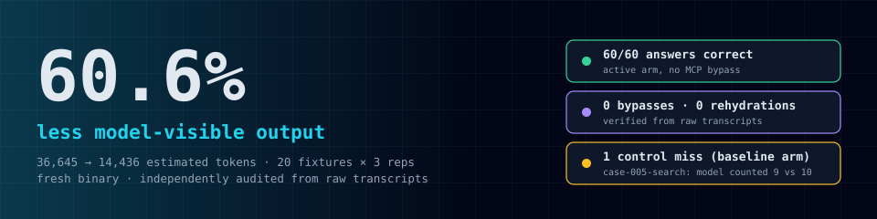
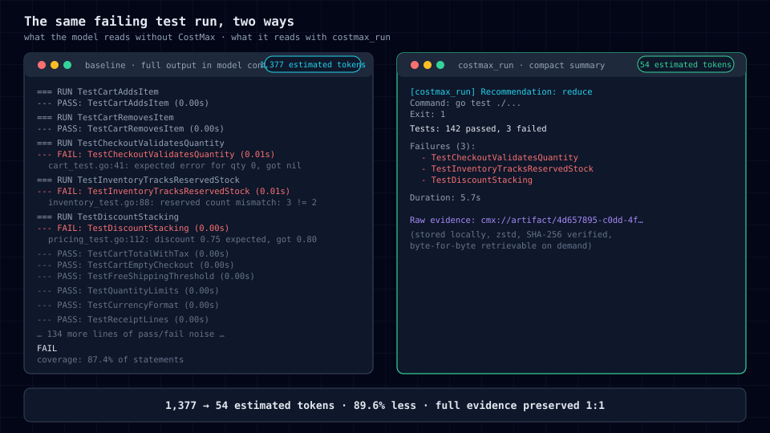
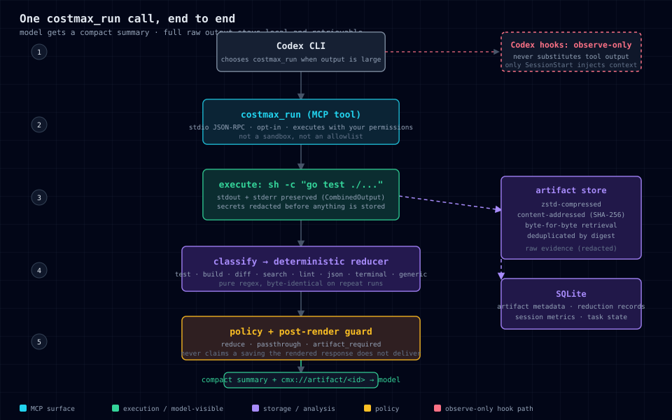
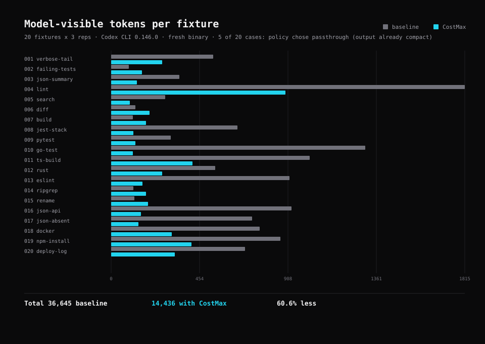
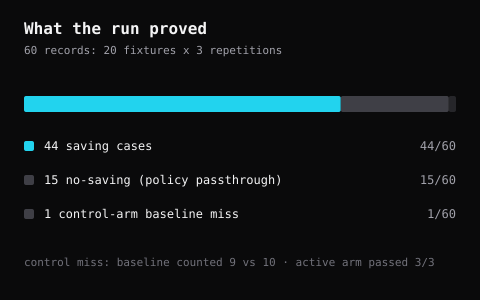

# CostMax

**A local-first efficiency layer for coding agents. It shrinks the tool
output your agent has to read, keeps the full evidence, and proves the
saving instead of claiming it.**

[](https://github.com/derinbarutcu17/costmaxx/actions/workflows/ci.yml)
[](https://github.com/derinbarutcu17/costmaxx/releases)
[](https://github.com/derinbarutcu17/costmaxx/releases)
[](https://go.dev/)
[](LICENSE)

<p align="center">
  
</p>

Coding agents burn tokens on output they barely use: 1,000-line test runs
for three failing tests, full diffs for a rename, complete build logs for
one error. CostMax intercepts those commands, returns the model a compact
summary, and keeps the raw output retrievable by digest.

Local-first: nothing leaves your machine. Codex CLI and opencode, as an
opt-in MCP server. Hooks are observe-only.

## Install

```bash
# From source
go install github.com/derinbarutcu17/costmaxx/cmd/costmax@latest

# Or a release binary (all platforms in Releases)
# macOS arm64:
curl -L -o costmaxx https://github.com/derinbarutcu17/costmaxx/releases/latest/download/costmaxx-darwin-arm64
chmod +x costmaxx
```

## Quickstart

Add CostMax's MCP entry to your Codex config (a backup is made first):

```bash
costmaxx install
costmaxx doctor
```

That writes this block to `~/.codex/config.toml`:

```toml
[mcp_servers.costmaxx]
command = "/path/to/costmaxx"
args = ["mcp"]
```

`costmax_run` is now available to Codex:

> **[`costmax_run`](docs/architecture.md)** — executes a local command and
> returns a compact, digest-addressable summary. Full output stored locally,
> retrievable via `cmx://artifact/<id>`.

It executes commands with your process permissions; it is not a sandbox.

---

## The same failing test run, two ways

<p align="center">
  
</p>

The model sees the exact signal it needs: pass/fail counts, failing test
names, duration. The full raw output stays local, zstd-compressed,
content-addressed, and byte-for-byte retrievable.

---

## How it works

<p align="center">
  
</p>

Every stage is deterministic. The same command, the same output, the same
compact summary, every time. No model in the loop for reduction, no guesses
in the policy, no way to claim a saving that the rendered response does not
deliver.

---

## The proof

CostMax's savings claims come from a live evaluation, not a benchmark
script that ran once on a laptop. One fresh binary, 20 deterministic
fixtures, 3 repetitions, audited from the raw Codex transcripts.

| Benchmark | What it measures | Result |
|---|---|---|
| 20 deterministic fixtures × 3 reps | Model-visible tool output (len/4 estimate) | **60.6% less** (36,645 → 14,436) |
| Fixture answer signals (test/build/diff/…) | Quality retention through reduction | **60/60 correct** |
| MCP discipline | Bypasses, direct commands, rehydration | **0 / 0 / 0** |
| Baseline control arm | Model without CostMax | 59/60 (1 count miss, reported honestly) |

<p align="center">
  
</p>

<p align="center">
  
</p>

The one control miss was the baseline arm (no CostMax): the model counted
9 matching files where the fixture had 10. The CostMax route answered that
same case correctly in all three repetitions. Control-arm noise, reported
honestly rather than hidden.

These are `len(text)/4` estimates of tool-result text, not billed-token
measurements. Methodology: [docs/benchmark-methodology.md](docs/benchmark-methodology.md).

## Why you can trust the numbers

Most token-compression tools report savings. CostMax ships the audit:

- `scripts/run-codex-eval.py` runs the 20 fixtures in three arms:
  baseline (no CostMax), preflight (MCP availability), active
  (`costmax_run` required, Bash forbidden).
- `scripts/verify-live-results.py` independently re-parses every raw Codex
  JSONL transcript. It fails if any active case bypassed MCP, called a
  command directly, rehydrated evidence, or missed its answer signal.
- A post-render guard refuses to claim a saving when the full response
  (including metadata) is not actually shorter than the raw output.

Re-run the whole thing yourself:

```bash
go test -buildvcs=false -count=1 ./...
python3 scripts/run-codex-eval.py --self-test
python3 scripts/run-codex-eval.py --fixture-smoke
go build -buildvcs=false -o /tmp/costmaxx ./cmd/costmax/
bash scripts/verify-active-path.sh /tmp/costmaxx
python3 scripts/run-codex-eval.py --live --yes \
  --binary /tmp/costmaxx --preflight-runs 3 --repetitions 3
python3 scripts/verify-live-results.py results/<your-run> \
  --expected-cases 20 --expected-repetitions 3 --forbid-rehydration
```

Full retained results: [docs/RESULTS.md](docs/RESULTS.md) ·
Independent audit write-up: [docs/VERIFICATION.md](docs/VERIFICATION.md)

---

## Usage

```bash
costmaxx hook                 # read a Codex lifecycle event from stdin (observe-only)
costmaxx mcp                  # start the MCP server (stdio JSON-RPC, newline framing)
costmaxx mcp --spec-framing   # MCP spec Content-Length framing (Python SDK, etc.)
costmaxx install              # add CostMax's named MCP entry to Codex
costmaxx install --target opencode  # register the MCP server in opencode.jsonc
costmaxx uninstall            # remove only that entry
costmaxx doctor               # check binary, config, storage, handshake
costmaxx status               # process-local metrics
costmaxx state <session-id>   # task state for a session
costmaxx report <session-id>  # session report from persisted metrics
costmaxx gc                   # garbage-collect old artifacts
costmaxx artifact add         # store raw output from stdin, print cmx:// envelope
costmaxx artifact retrieve <id>  # print the full stored output of an artifact
```

## opencode integration

CostMax is registered as a local stdio MCP server in `opencode.jsonc`
(`costmaxx install --target opencode` writes the block, backing up first). The
tool shows up as `costmaxx_costmax_run`.

A companion plugin, `~/.config/opencode/plugins/costmaxx.ts`, auto-compresses
bash tool results larger than a threshold (default 20k chars) into the same
`cmx://artifact/<id>` envelope, storing the full raw output — the model can
retrieve it with `costmaxx artifact retrieve <id>` or the MCP resource.
Config: `COSTMAX_DISABLE=1` disables the plugin; `COSTMAX_COMPRESS_THRESHOLD`
or `[reduce] threshold` in `~/.costmax/config.toml` set the cutoff. The
artifact store is shared with Codex sessions.

## What CostMax does not claim

- **No billed-dollar savings.** Token figures are `len(text)/4` estimates,
  not provider invoices.
- **No universal intelligence retention.** Proven on deterministic
  fixtures, not arbitrary production repositories.
- **No automatic adoption.** The model must call `costmax_run` explicitly;
  hooks remain observe-only.
- **Codex-only today.** Hermes, Claude, and other harnesses are future work.
  opencode is supported via the MCP server and plugin above.

## Docs

- [Architecture](docs/architecture.md) · [Reduction format](docs/reduction-format.md)
- [Privacy model](docs/privacy-model.md) · [Capability matrix](docs/capability-matrix.md)
- [Proof plan](docs/PROOF_PLAN.md) · [Evaluation protocol](docs/EVALUATION_PROTOCOL.md)

## Contributing

See [CONTRIBUTING.md](CONTRIBUTING.md) and the
[issue templates](.github/ISSUE_TEMPLATE/). Questions go to
[Discussions](https://github.com/derinbarutcu17/costmaxx/discussions).

## License

MIT. See [LICENSE](LICENSE).
