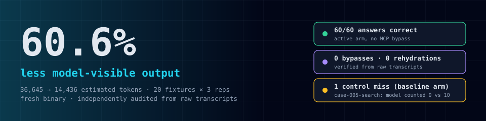
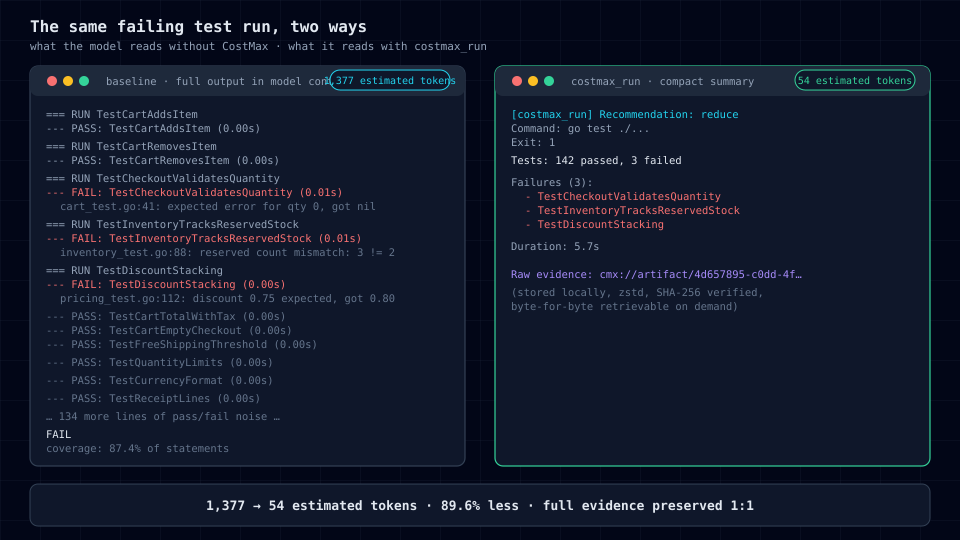
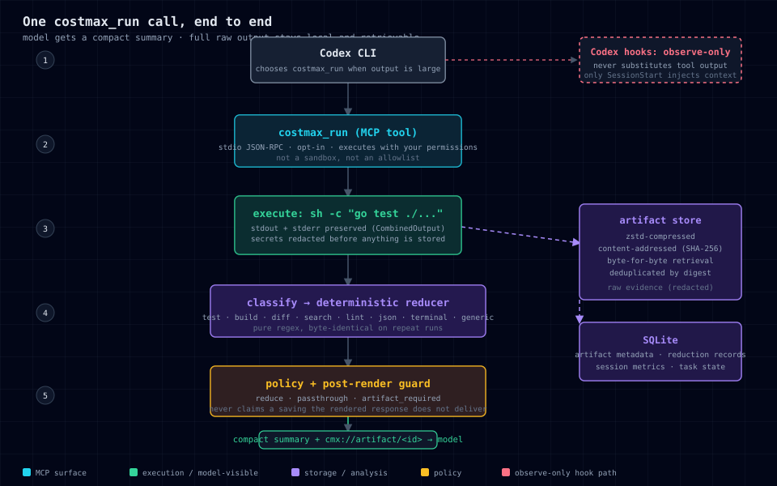
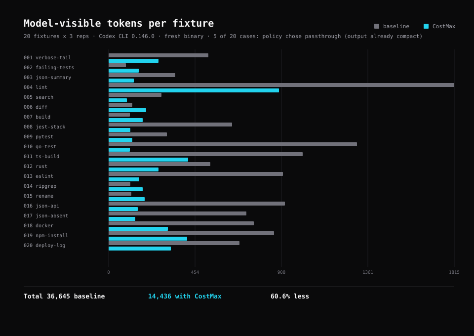
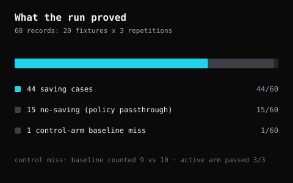

# CostMax

**Your agent burns context on output it barely reads. CostMax shrinks what it
reads, keeps the full evidence, and measures the saving instead of claiming
it.**

[](https://github.com/derinbarutcu17/costmaxx/actions/workflows/ci.yml)
[](https://github.com/derinbarutcu17/costmaxx/releases)
[](https://github.com/derinbarutcu17/costmaxx/releases)
[](https://go.dev/)
[](LICENSE)

<p align="center">
  
</p>

## Live savings

Measured on the owner's daily stack (opencode + codex, deepseek-v4-flash),
7-day window, 2026-08-27 — the last snapshot recorded before reporting moved
to the immutable per-call ledger. Current reporting (`costmaxx savings`) is
ledger-based by actual event timestamp; see
[docs/HONEST-NUMBERS.md](docs/HONEST-NUMBERS.md):

| Metric | Value |
|---|---|
| Raw input tokens read by the agent | 392,748 |
| Model-visible tokens after CostMax | 51,820 |
| **Context cut** | **86.8%** |
| Tool calls reduced | 53 |
| Evidence dropped from context, stored & retrievable | 1.04 MB |

We ship the scoreboard, not a screenshot. These figures are `len(text)/4`
estimates on one user's stack — see [Why you can trust the numbers](#why-you-can-trust-the-numbers) and
[docs/HONEST-NUMBERS.md](docs/HONEST-NUMBERS.md) for exactly what they mean.

---

## The 30-second story

Coding agents burn tokens on output they barely use: 1,000-line test runs
for three failing tests, full diffs for a rename, complete build logs for
one error. When a command is routed through `costmax_run`, CostMax returns a
compact summary and keeps the raw output retrievable by digest.

Local-first: CostMax sends no telemetry. Commands execute with your process
permissions and may contact external services if the command itself does.
It's a plain stdio MCP server: any MCP-capable agent can register it (Codex
CLI, opencode, Hermes, Gemini CLI, or your own client) and call the opt-in
`costmax_run` tool. Codex additionally gets observe-only lifecycle hooks that
record evidence; no hook replaces tool output.

**Before and after — the same failing test run, two ways:**

<p align="center">
  
</p>

The model sees the exact signal it needs: pass/fail counts, failing test
names, duration. The full raw output stays local, zstd-compressed,
content-addressed, and byte-for-byte retrievable.

---

## How it works

<p align="center">
  
</p>

Every stage is deterministic. The same command, the same output, the same
compact summary, every time. No model in the loop for reduction, no guesses
in the policy, no way to claim a saving that the rendered response does not
deliver.

---

## Three axes, one bill

CostMax is the input side of a trinity that already exists. The other two
tools are real and excellent; we stack with them, not against them.

| | **CostMax** (this repo) | **[Caveman](https://github.com/JuliusBrussee/caveman)** | **[ponytail](https://github.com/DietrichGebert/ponytail)** |
|---|---|---|---|
| Shrinks | **input** — what the agent *reads* (tool output) | **output** — how terse the agent *talks* (prose) | **work** — how little code the agent *writes* (YAGNI) |
| Mechanism | compress + losslessly store tool output | prompt skill that makes replies terse | prompt skill that makes solutions minimal |
| Measured | yes — self-measured, continuously | independently benchmarked | independently benchmarked |
| Evidence integrity | full raw output kept, byte-for-byte retrievable | n/a (nothing discarded) | n/a (nothing discarded) |
| Stacks with | Caveman + ponytail | CostMax + ponytail | CostMax + Caveman |

One honest line: their numbers come from independent benchmarks; ours are
self-measured on a single stack. Different methods, same direction — and the
input side, CostMax's, is the one that dominates agentic bills.

---

## Install

```bash
# From source (the package dir is `costmax`; install it as `costmaxx`):
go install github.com/derinbarutcu17/costmaxx/cmd/costmax@latest \
  && mv "$(go env GOPATH)/bin/costmax" "$(go env GOPATH)/bin/costmaxx"

# Or a release binary (all platforms in Releases)
# macOS arm64:
curl -L -o costmaxx https://github.com/derinbarutcu17/costmaxx/releases/latest/download/costmaxx-darwin-arm64
chmod +x costmaxx

# Wire it up (backups made first):
costmaxx install                      # Codex (~/.codex/config.toml)
costmaxx install --target opencode    # opencode (opencode.jsonc)
costmaxx install --target hermes      # Hermes (~/.hermes/config.yaml)
```

`costmaxx install` modifies exactly one named MCP config file for Codex,
opencode, or Hermes. It creates a timestamped backup beside an existing file,
refuses to overwrite a non-CostMax entry, and writes through an atomic rename.
It never installs hooks or plugins.

Per-agent matrix, uninstall, and daily maintenance: [docs/INSTALL.md](docs/INSTALL.md).

## Quickstart

```bash
costmaxx install
costmaxx doctor
```

That writes this block to `~/.codex/config.toml`:

```toml
[mcp_servers.costmaxx]
command = "/path/to/costmaxx"
args = ["mcp"]
```

`costmax_run` is now available to Codex:

> **[`costmax_run`](docs/architecture.md)** — executes a local command and
> returns a compact, digest-addressable summary. Full output stored locally,
> retrievable via `cmx://artifact/<id>`.

It executes commands with your process permissions; it is not a sandbox.

---

## The proof

CostMax's savings claims come from a live evaluation, not a benchmark
script that ran once on a laptop. One fresh binary, 20 deterministic
fixtures, 3 repetitions, audited from the raw Codex transcripts.

> Auditability: the retained 2026-08-05 run's raw transcripts are **not
> committed in this checkout**, so those numbers are historical documentation,
> not locally re-auditable evidence. The exact blocker, the strict audit
> command, and how to re-produce the run are in [docs/RESULTS.md](docs/RESULTS.md).
> The deterministic checks that DO run from a clean checkout are listed under
> [Why you can trust the numbers](#why-you-can-trust-the-numbers).

This checkout also contains a compact, ignored local bundle from a fresh
2026-09-02 real-Codex run (`results/20260902T-live-proof/`): 60/60 active
quality passes, 55.4% lower model-visible estimates, and an independently
passing transcript audit. It is local evidence, not committed repository
evidence; see [docs/RESULTS.md](docs/RESULTS.md) for the hash and exact audit
command.

| Benchmark | What it measures | Result |
|---|---|---|
| 20 deterministic fixtures × 3 reps | Model-visible tool output (len/4 estimate) | **60.6% less** (36,645 → 14,436) |
| Fixture answer signals (test/build/diff/…) | Quality retention through reduction | **60/60 correct** |
| MCP discipline | Bypasses, direct commands, rehydration | **0 / 0 / 0** |
| Baseline control arm | Model without CostMax | 59/60 (1 count miss, reported honestly) |

<p align="center">
  
</p>

<p align="center">
  
</p>

The one control miss was the baseline arm (no CostMax): the model counted
9 matching files where the fixture had 10. The CostMax route answered that
same case correctly in all three repetitions. Control-arm noise, reported
honestly rather than hidden.

Exit semantics: the evaluator exits `0` when the active arm and the harness
invariants pass. A baseline answer mismatch on a valid baseline transcript is
recorded as an explicit control miss/warning (`baseline.control_miss` in
`report.json`, a `Control miss` column + aggregate in `report.md`, and a
console `WARN`) and does not fail the run. Missing baseline transcripts,
baseline subprocess/command errors, active errors, active answer mismatches,
and MCP bypasses still fail closed; `verify-live-results.py --require-baseline`
stays strict and fails on the control miss.

These are `len(text)/4` estimates of tool-result text, not billed-token
measurements. Methodology: [docs/benchmark-methodology.md](docs/benchmark-methodology.md).

## Why you can trust the numbers

Most token-compression tools report savings. CostMax ships the audit:

- `scripts/run-codex-eval.py` runs the 20 fixtures in three arms:
  baseline (no CostMax), preflight (MCP availability), active
  (`costmax_run` required, Bash forbidden).
- `scripts/verify-live-results.py` independently re-parses every raw Codex
  JSONL transcript. It fails if any active case bypassed MCP, called a
  command directly, rehydrated evidence, or missed its answer signal.
- A post-render guard refuses to claim a saving when the full response
  (including metadata) is not actually shorter than the raw output.

Re-run the whole thing yourself:

```bash
go test -buildvcs=false -count=1 ./...
python3 scripts/run-codex-eval.py --self-test
python3 scripts/run-codex-eval.py --fixture-smoke
go build -buildvcs=false -o /tmp/costmaxx ./cmd/costmax/
bash scripts/verify-active-path.sh /tmp/costmaxx
python3 scripts/run-codex-eval.py --live --yes \
  --binary /tmp/costmaxx --preflight-runs 3 --repetitions 3
python3 scripts/verify-live-results.py results/<your-run> \
  --expected-cases 20 --expected-repetitions 3 --forbid-rehydration
```

Full retained results: [docs/RESULTS.md](docs/RESULTS.md) ·
Independent audit write-up: [docs/VERIFICATION.md](docs/VERIFICATION.md) ·
The full honesty brief: [docs/HONEST-NUMBERS.md](docs/HONEST-NUMBERS.md)

---

## Usage

```bash
costmaxx hook                 # read a Codex lifecycle event from stdin (observe-only)
costmaxx mcp                  # start the MCP server (stdio JSON-RPC, newline framing)
costmaxx mcp --spec-framing   # MCP spec Content-Length framing (Python SDK, etc.)
costmaxx install              # add CostMax's named MCP entry to Codex
costmaxx install --target opencode  # register the MCP server in opencode.jsonc
costmaxx install --target hermes    # register the MCP server in ~/.hermes/config.yaml
costmaxx uninstall            # remove only that entry (use --target for opencode/hermes)
costmaxx doctor               # check binary, config, storage, handshake
costmaxx status               # process-local metrics
costmaxx savings              # aggregate savings report (daily/weekly snapshots)
costmaxx state <session-id>   # task state for a session
costmaxx report <session-id>  # session report from the call ledger
costmaxx gc                   # garbage-collect old artifacts (files + metadata)
costmaxx replay <id>          # re-run the stored command of an artifact
costmaxx artifact add         # store raw output from stdin, print cmx:// envelope
costmaxx artifact add --call-ref <key>   # same key = same logical call (retry dedup)
costmaxx artifact retrieve <id>  # print the full stored output of an artifact
costmaxx artifact path <id>   # print the on-disk storage path of an artifact
```

Every `artifact add` counts as one call. Without `--call-ref` (alias
`--idempotency-key`) each invocation is an independent call and is recorded
separately; passing an explicit key opts into retry deduplication — re-running
with the same key replays the canonical stored envelope instead of recording a
second call.

## The receipt

Every envelope carries a machine-parseable `Receipt:` line so agents can act
without fetching the artifact:

```
Receipt: kept 15/78 lines | dropped 3284 B | tests failed: TestAuth1, TestAuth2, +2 more | replay: costmaxx replay 3ebf2cff-…
Receipt: replay: costmaxx replay 3ebf2cff-…        # passthrough (nothing cut)
```

- `kept X/Y lines` and `dropped N B` appear only when output was actually
  reduced; failing test names are capped at five (deduped, then `+N more`).
- `replay` re-runs the stored command in its stored working directory
  (`--cwd` on `artifact add`), propagating the original exit code.
- The full raw output is always stored and retrievable via
  `artifact retrieve <id>` or the `cmx://artifact/<id>` MCP resource.

## opencode integration

CostMax is registered as a local stdio MCP server in `opencode.jsonc`
(`costmaxx install --target opencode` writes the block, backing up first). The
tool shows up as `costmaxx_costmax_run` and behaves identically to the Codex
MCP path: execute, reduce, store, retrieve.

An opencode auto-compression TypeScript plugin (`~/.config/opencode/plugins/
costmaxx.ts`) is **documented but not shipped in this repository** — there is
no plugin file under `packages/` or the repo root, and this checkout makes no
claim that opencode compresses tool output automatically. Until such a plugin
exists and is installed, opencode compression happens only when the model
calls `costmaxx_costmax_run` explicitly (or the CLI `costmaxx artifact add`
pipes the output). Any third-party plugin you install is external to CostMax
and outside this repo's integrity guarantees.

### Ecosystem: stacking, not competing

Pairs with [Caveman](https://github.com/JuliusBrussee/caveman) and
[ponytail](https://github.com/DietrichGebert/ponytail)-style skills — they
shape what the agent writes, CostMax shapes what it reads. Same bill, three
sides.

## Hermes integration

Hermes is MCP client support, not a bespoke adapter. `costmaxx install --target
hermes` writes a `costmaxx` entry under the top-level `mcp_servers:` key in
`~/.hermes/config.yaml` (backing up first), so Hermes launches the stdio MCP
server at startup. Hermes' tools list names it `costmaxx:costmax_run`; the
model-facing namespace is `mcp__costmaxx__costmax_run`. MCP use stays
opt-in: Hermes only compresses when the model calls that tool.

## What CostMax does not claim

- **No billed-dollar savings.** Token figures are `len(text)/4` estimates,
  not provider invoices.
- **No universal intelligence retention.** Proven on deterministic
  fixtures, not arbitrary production repositories.
- **No automatic adoption.** The model must call `costmax_run` explicitly;
  hooks remain observe-only.
- **Codex-only hooks.** The only bespoke adapter is Codex (observe-only hooks);
  Claude/Hermes bespoke adapters were removed. opencode and Hermes are MCP
  client support — `costmaxx install --target opencode|hermes` registers the
  stdio MCP server in the client's own config. The MCP tool is
  client-agnostic: any spec-compliant MCP client can register `costmaxx mcp`.
  No auto-compression plugin ships in this repository.

## Docs

- [Install per agent](docs/INSTALL.md) · [Architecture](docs/architecture.md) · [Reduction format](docs/reduction-format.md)
- [Honest numbers](docs/HONEST-NUMBERS.md) · [Privacy model](docs/privacy-model.md) · [Capability matrix](docs/capability-matrix.md)
- [Proof plan](docs/PROOF_PLAN.md) · [Evaluation protocol](docs/EVALUATION_PROTOCOL.md)

## Contributing

See [CONTRIBUTING.md](CONTRIBUTING.md) and the
[issue templates](.github/ISSUE_TEMPLATE/). Questions go to
[Discussions](https://github.com/derinbarutcu17/costmaxx/discussions).

## License

MIT. See [LICENSE](LICENSE).
